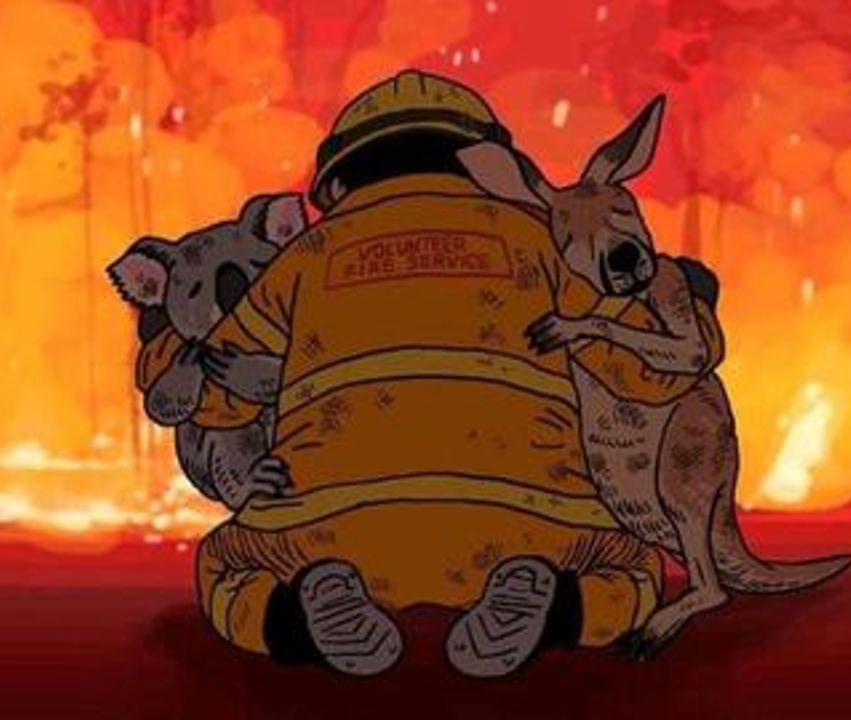
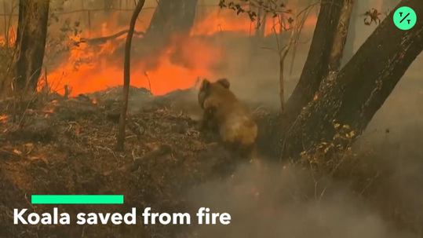
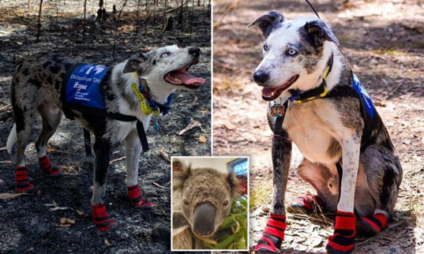
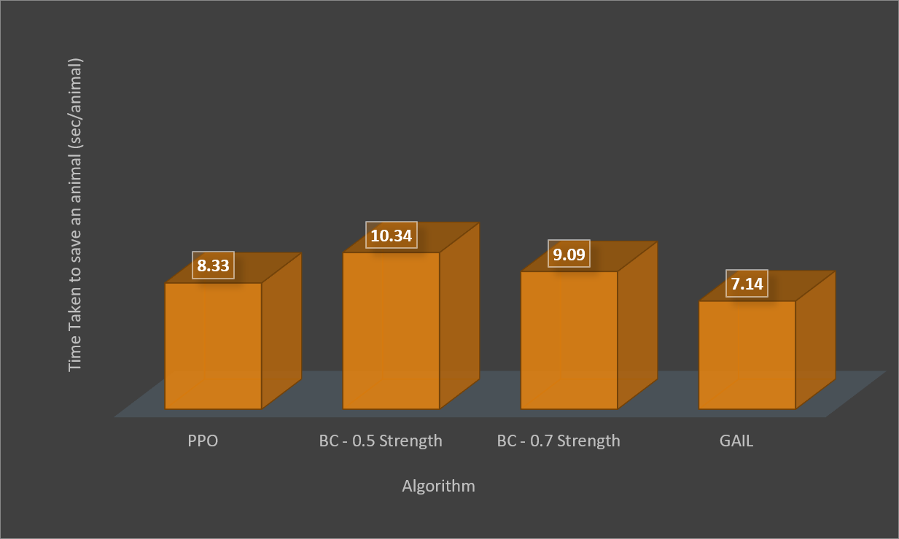

# FiRescue

 </img>

<h4>Game Motivation: </h4>

</img> </img>

The idea for the project was motivated from the recent devastated forest fire which occurred in the forests of Australia. The forest rescue team used trained dogs to save Koala bears which were stuck in the forest fire.
The trained dogs were able to identify the vulnerable Koala bears in the fire by the bears' cry noises and  saved them by carrying them with their mouths out of the dangerous areas.

<h4>Game Play:</h4> 
In our project we simulate a wildfire in a forest terrain, which is the home of various animals. We used multiple algorithms to train our dog agent to get into the forest, and save the endangered and vulnerable animals from the fire without hurting itself. The complete game has been created using  Unity and Unity ML Agents. Algorithms used -

1. Proximal Policy Optimization
2. Behavioral Cloning - 0.5 Strength
3. Behavioral Cloning - 0.7 Strength
4. Generative Adversarial Imitation Learning

<h4>Algorithm Comparison</h4>
</img>

<h4>Developer Details:</h4>
This game was developed as part of CSCI 599: Applied Machine Learning for Games at University of Southern California. Special thanks to Prof. Mike Zyda for his consistent support that helped us with our project during this semester.

1. Nisha Mariam Thomas - Gameplay, Machine Learning & UI Engineer
2. Ayush Bihani  - Gameplay & Machine Learning Engineer
3. Deepthi Bhat - Gameplay & UI Engineer
4. Karthik Bhat - Gameplay & UI Engineer
5. Anthony Prajwal - Gameplay & UI Engineer

<h4>Credits:</h4>
<ol>
<li>Unity Assets - Models - Dog agent, Forest animals, safe zone (girl) and unity standard assets</li>
<li>https://github.com/Unity-Technologies/ml-agents</li>
<li>https://freesound.org/ - Game Audio</li>
<li>http://www.orangefreesounds.com/airy-melancholic-synth-pad/ - Video Audio</li>
<li>http://www.orangefreesounds.com/happy-electronic-music/ - Video Audio</li>
</ol>

<h4>More information - </h4> https://nfnu.itch.io/firescue

<h4>FiRescue Trailer - </h4> https://www.youtube.com/watch?v=NCc9hNJboEM

